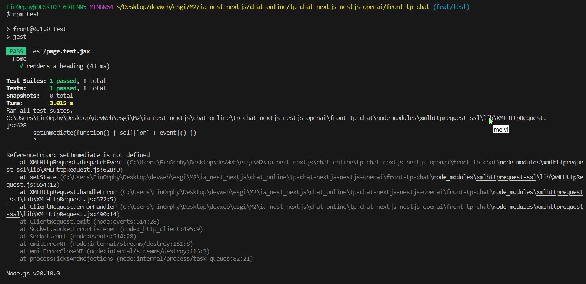

# Projet Front Chat CI/CD  <a name="readme-top"></a>

## Auteurs 🎭

* **Rédouane RÉMILI** _alias_ [@FinOrfy](https://github.com/red-rml)

## Présentation du projet 👍

Il s’agit d’un projet next.js visant à permettre un chat en ligne entre plusieurs utilisateurs.

Dans ce dépôt gitHub il n’y a que la partie Front. 

## Technologies Utilisées

- **NodeJS**

- **NextJS** 

- **Docker** 

- **GitHub Action**

---

# Sujet 📖

## Introduction

Mettre à jour un projet avec GitHub Actions pour :

Mettre en place une procédure d’intégration continue (CI) sur les pull requests envoyées à votre projet

Mettre en place une procédure de déploiement continu, en extension du CI, sur la branch principale de votre dépôt de code

Mettre en place une procédure de livraison continue (CD) lors de la création d’un tag git sur votre dépôt


## CI/CD

### Intégration continue

=> **Pour une PR :**

Faire la commande : ```npm install``` 

Vérification du code avec le linter : ```npm run lint```

Faire le tests : ```npm run test``` (désactivé car un bug est présent : voir la capture d'écran)


Build du projet : ```npm run build```

Vérification du linter dockerfile : ```hadolint Dockerfile```

### Déploiement continue 

Création d'une Pull Request d’une branche tier vers la branche main.

La CI se déclenche automatiquement

Si la CI est un succès, valider le merge de la PR.

On peut voir sur github action le déploiement de l'image docker.

-> En cas de succès, le livrable est déployé (Mis en place pour la branche master uniquement) :

Le livrable du déploiement continu est une image Docker "latest" poussée sur DockerHub. Un fichier Dockerfile passant la validation hadolint est utilisé.

### Livraison continue

Créer un tag et le nommer selon la norme (majeure.mineure.corrective).

Pousser le tag qui vient d’être créé.

Lancement CI

Si succès le livrable est une image docker sur DockerHub avec le tag nommé précédemment.

-> A la création d'un tag git et si le CI est un succès :

Le livrable de la livraison continue est une image Docker poussée sur DockerHub dont le tag est le tag git. 


<p align="right">(<a href="#readme-top">retour en haut ⬆</a>)</p>